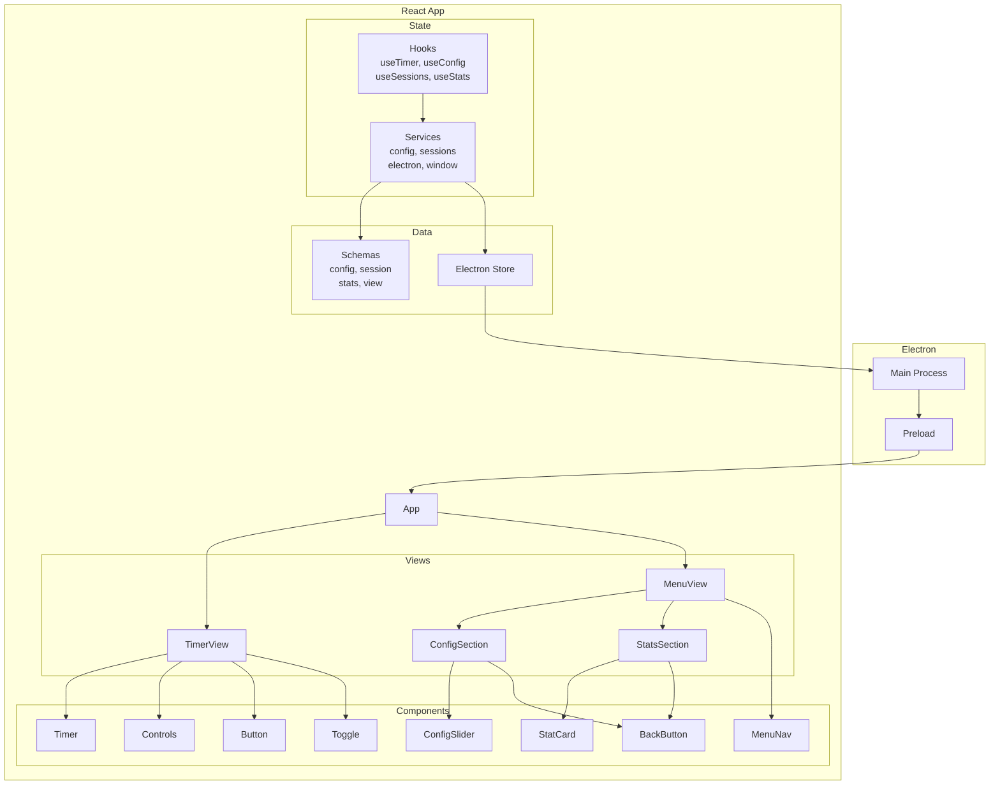

# Hollow

A minimal Pomodoro timer for desktop.

## Quick Start

```bash
bun install
bun run dev
```

## Build

```bash
bun run build        # Build for current OS
bun run build:win    # Windows
bun run build:mac    # macOS
bun run build:linux  # Linux
```

## Architecture


