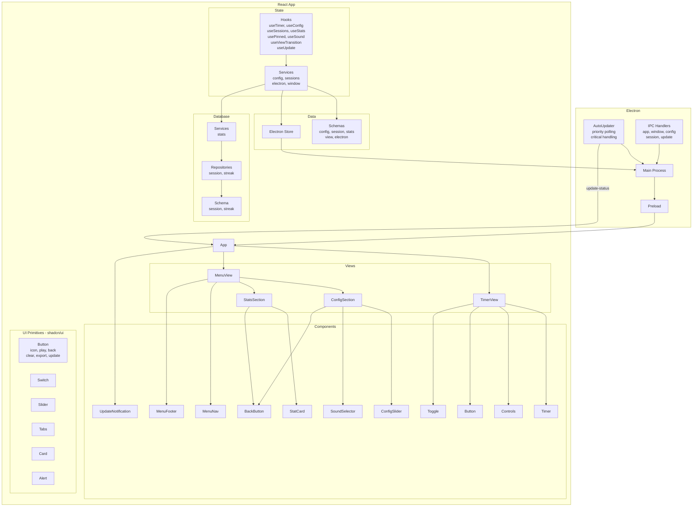
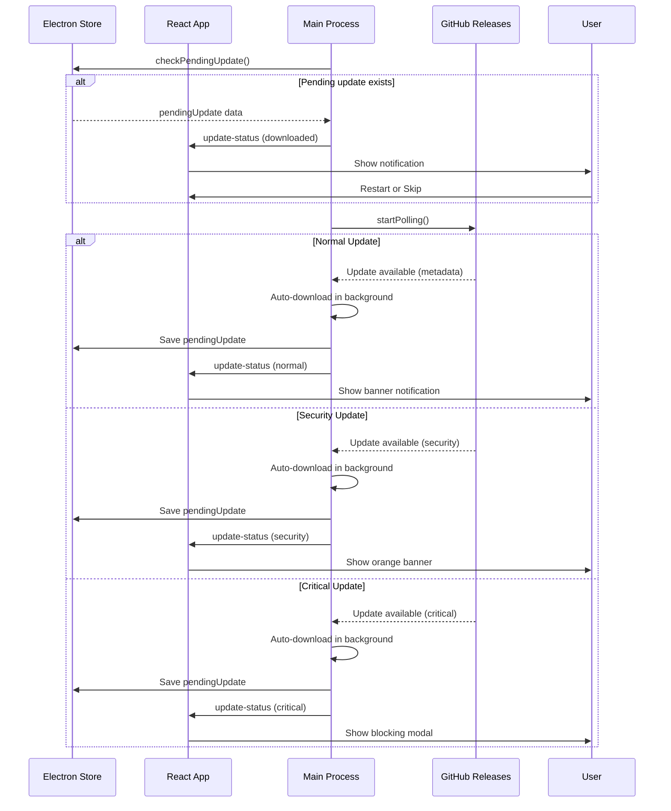

<div align="center">
  

  <h1>Hollow</h1>

  <p><strong>A minimalist Pomodoro timer for desktop</strong></p>

  <p>
    <em>Focus on what matters. Time flows.</em>
  </p>

  <p>
    <a href="https://electronjs.org">
      
    </a>
    <a href="https://react.dev">
      
    </a>
    <a href="https://www.typescriptlang.org">
      
    </a>
    <a href="https://bun.sh">
      
    </a>
    <a href="https://codecov.io/gh/torrescereno/hollow">
      
    </a>
  </p>

  <p>
    <a href="#features">Features</a> •
    <a href="#tech-stack">Tech Stack</a> •
    <a href="#architecture">Architecture</a> •
    <a href="#installation">Installation</a>
  </p>
</div>

---

## ✨ Features

| ⏱️ **Smart Timer**                     | 📊 **Detailed Statistics**                                 |
| :------------------------------------- | :--------------------------------------------------------- |
| Customizable focus and break intervals | Complete session history and streaks                       |
| **⚙️ Flexible Configuration**          | **🔄 Automatic Updates**                                   |
| Duration, sounds, and window behavior  | Smart updates with critical, security, and normal priority |
| **💾 Local Storage**                   |                                                            |
| Private data, no internet connection   |                                                            |

---

## 🛠️ Tech Stack

### Frontend

| Technology          | Purpose                  |
| ------------------- | ------------------------ |
| **React 19**        | UI Framework             |
| **TypeScript**      | Static typing            |
| **Tailwind CSS v4** | Styles                   |
| **shadcn/ui**       | Primitive UI components  |
| **Radix UI**        | Accessibility primitives |
| **Motion**          | Animations               |
| **Lucide React**    | Icons                    |

### Desktop

| Technology         | Purpose                   |
| ------------------ | ------------------------- |
| **Electron 33**    | Desktop framework         |
| **Electron Store** | Configuration persistence |

### Build

| Tool                 | Purpose         |
| -------------------- | --------------- |
| **Vite**             | Build tool      |
| **Bun**              | Package manager |
| **Electron Builder** | Packaging       |

---

## 🏗️ Architecture

Hollow follows a **layered architecture** with clear separation of concerns:

### System Overview



### Update System



### Update Priority Levels

| Priority     | Interval | Behavior                                                                  |
| ------------ | -------- | ------------------------------------------------------------------------- |
| **Normal**   | 60 min   | Silent download, notify. Skip actually skips, re-shows on restart         |
| **Security** | 15 min   | Silent download, notify with recommended action. Persists across restarts |
| **Critical** | 5 min    | Silent download, blocking modal with countdown and snooze                 |

### Layer Summary

| Layer          | Responsibility               | Technologies                      |
| -------------- | ---------------------------- | --------------------------------- |
| **Views**      | UI and presentation          | React, TypeScript                 |
| **Components** | Application components       | React, shadcn/ui                  |
| **Primitives** | Reusable UI primitives       | shadcn/ui, Radix UI, Tailwind CSS |
| **State**      | Business logic and data flow | Custom Hooks                      |
| **Services**   | External integrations        | Electron API                      |
| **Data**       | Persistence and schemas      | Electron Store, Zod               |
| **Database**   | Structured storage           | Better-SQLite3, Drizzle ORM       |

---

## 🎨 Design System

Hollow uses **shadcn/ui** as the base for UI components, built on **Radix UI** for accessibility and **Tailwind CSS v4** for styling.

### UI Components

| Component  | Based on         | Description                                         |
| ---------- | ---------------- | --------------------------------------------------- |
| **Button** | shadcn/ui Button | 6 variants: icon, play, back, clear, export, update |
| **Switch** | Radix UI Switch  | Configuration toggle                                |
| **Slider** | Radix UI Slider  | Slider control for durations                        |
| **Tabs**   | Radix UI Tabs    | Section navigation                                  |
| **Card**   | shadcn/ui Card   | Statistics container                                |
| **Alert**  | shadcn/ui Alert  | Warning notifications                               |

### Dark Theme

The minimalist design uses an opacity system on a dark background:

```css
--background: #0f0f0f;
--foreground: #ffffff;
--secondary: rgb(255 255 255 / 0.05);
--accent: rgb(255 255 255 / 0.1);
```

---

## 📸 Screenshots

<div align="center">

|                       Timer View                        |                       Config View                        |
| :-----------------------------------------------------: | :------------------------------------------------------: |
|  |  |

|                       Stats View                        |
| :-----------------------------------------------------: |
|  |

</div>

---

## 🚀 Installation

### Downloads

Download the latest version from [GitHub Releases](https://github.com/torrescereno/hollow/releases/latest).

| Platform    | Architecture  | Format             |
| ----------- | ------------- | ------------------ |
| **Windows** | x64           | `.msi`             |
| **Linux**   | x64           | `.AppImage` `.deb` |
| **macOS**   | Apple Silicon | `.dmg` `.zip`      |
| **macOS**   | Intel         | `.dmg` `.zip`      |

#### macOS: First Run

The app is not signed with Apple Developer. After installing, run in Terminal:

```bash
xattr -cr /Applications/Hollow.app
```

> **Note:** Automatic updates are not available on macOS (requires Apple Developer signature). Download new versions manually from [Releases](https://github.com/torrescereno/hollow/releases/latest).

### Development

#### Prerequisites

- **Node.js** >= 18.x
- **Bun** >= 1.0 (recommended) or npm

#### Quick Start

```bash
# Clone the repository
git clone https://github.com/torrescereno/hollow.git
cd hollow

# Install dependencies
bun install

# Run in development mode
bun run dev
```

<details>
<summary><b>📖 Development Scripts</b></summary>

| Command               | Description                        |
| --------------------- | ---------------------------------- |
| `bun run dev`         | Development server with hot reload |
| `bun run build`       | Production build (auto-detects OS) |
| `bun run build:win`   | Build for Windows (.exe)           |
| `bun run build:mac`   | Build for macOS (.dmg)             |
| `bun run build:linux` | Build for Linux (.AppImage, .deb)  |

</details>

---

<div align="center">
  <sub>Made with ❤️ by <a href="https://github.com/torrescereno">torrescereno</a></sub>
</div>
